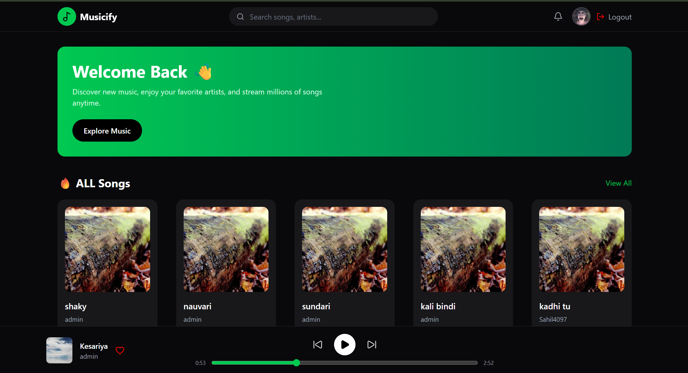
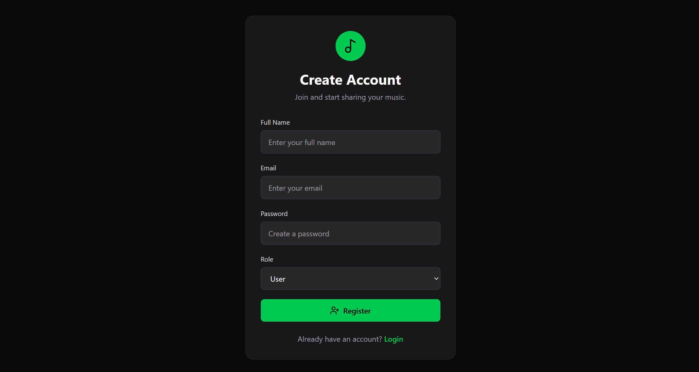
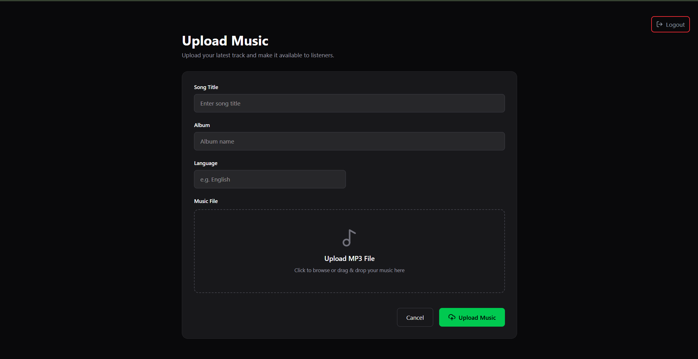
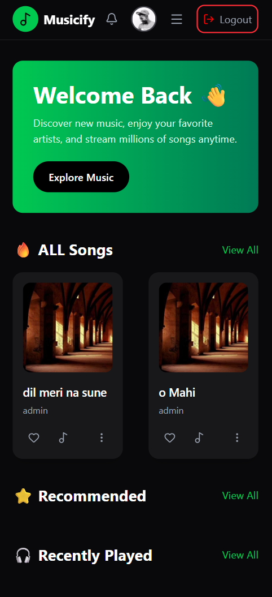

# 🎵 Music Streaming App


A full-stack **Music Streaming Application** built with **React**, **Node.js**, **Express.js**, and **MongoDB**. The application provides secure authentication, role-based authorization, music playback, and an admin panel for uploading songs.

---

## 📖 Overview

This project allows users to create an account, log in securely, browse available songs, and enjoy music using a custom player. Administrators have exclusive access to upload new music and manage the application's content.

The project demonstrates full-stack development concepts including:

- JWT Authentication
- Protected Routes
- File Upload with Multer
- REST APIs
- MongoDB Integration
- React State Management
- Responsive UI using Tailwind CSS

---

## ✨ Features

### 👤 User Features

- User Registration
- Secure Login & Logout
- JWT Authentication
- Browse Music Library
- Play Songs
- Pause Songs
- Skip Forward
- Skip Backward
- Seek Music Using Progress Bar
- Responsive User Interface

### 👑 Admin Features

- Secure Admin Authentication
- Protected Upload Page
- Upload Songs
- Add Song Details
- Manage Music Library

---

## 🛠 Tech Stack

### Frontend

- React.js
- Tailwind CSS
- React Router DOM
- Axios
- React Toastify
- Lucide React Icons

### Backend

- Node.js
- Express.js
- MongoDB
- Mongoose
- JWT Authentication
- Multer
- Cookie Parser
- CORS

---

## 📂 Folder Structure

```
music-streaming-app/
│
├── client/
│   ├── src/
│   │   ├── assets/
│   │   ├── components/
│   │   ├── pages/
│   │   ├── services/
│   │   ├── App.jsx
│   │   └── main.jsx
│   │
│   └── package.json
│
├── server/
│   ├── controllers/
│   ├── middleware/
│   ├── models/
│   ├── routes/
│   ├── uploads/
│   ├── config/
│   ├── server.js
│   └── package.json
│
├── screenshots/
│
└── README.md
```

---

## 📸 Screenshots

### 🏠 Home Page



---

### 🔐 Login Page


---

### 📝 Register Page



---

### ⬆️ Upload Music (Admin)



---
### 📱 Responsive Design



---

## 🚀 Installation

### Clone Repository

```bash
git clone https://github.com/SAHIL-DEV-1702/music-streaming-app.git
```

Move into the project directory:

```bash
cd music-streaming-app
```

Install frontend dependencies:

```bash
cd client
npm install
```

Install backend dependencies:

```bash
cd ../server
npm install
```

---

## ⚙️ Environment Variables

Create a `.env` file inside the **server** folder.

```env
PORT=8000

MONGO_URI=your_mongodb_connection_string

JWT_SECRET=your_secret_key
```

---

## ▶️ Running the Project

### Backend

```bash
cd server
npm run dev
```

### Frontend

```bash
cd client
npm run dev
```

Frontend:

```
http://localhost:5173
```

Backend:

```
http://localhost:8000
```

---

## 🔐 Authentication

The application uses **JWT Authentication** stored securely in cookies.

### User Authentication Flow

- Register
- Login
- Receive JWT Token
- Access Protected Routes
- Logout

---

## 📡 API Endpoints

### Authentication

| Method | Endpoint             | Description   |
| ------ | -------------------- | ------------- |
| POST   | `/api/auth/register` | Register User |
| POST   | `/api/auth/login`    | Login User    |
| POST   | `/api/auth/logout`   | Logout User   |

### Music

| Method | Endpoint            | Description          |
| ------ | ------------------- | -------------------- |
| GET    | `/api/music`        | Get All Music        |
| POST   | `/api/music/upload` | Upload Music (Admin) |

---

## 🔒 Protected Routes

| Route        | Access     |
| ------------ | ---------- |
| Home         | Public     |
| Login        | Public     |
| Register     | Public     |
| Upload Music | Admin Only |

---

## 🎯 Future Improvements

- ❤️ Like Songs
- 🎼 Playlist Support
- 🔍 Search Songs
- 🎧 Recently Played
- 📜 Lyrics
- 🎤 Artist Profiles
- 🌙 Dark Mode
- 🔀 Shuffle
- 🔁 Repeat
- 📊 Music Analytics

---

## 🤝 Contributing

Contributions are welcome!

1. Fork the repository
2. Create a new branch

```
git checkout -b feature-name
```

3. Commit your changes

```
git commit -m "Added new feature"
```

4. Push to your branch

```
git push origin feature-name
```

5. Create a Pull Request

---

## 👨‍💻 Author

### Sahil Patil

- GitHub: https://github.com/SAHIL-DEV-1702
- LinkedIn: https://www.linkedin.com/in/sahil-patil-s17

---

## ⭐ Support

If you found this project helpful, please consider giving it a ⭐ on GitHub.

---

## 📄 License

This project is licensed under the MIT License.
